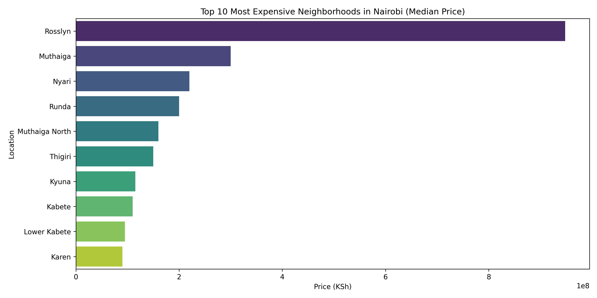
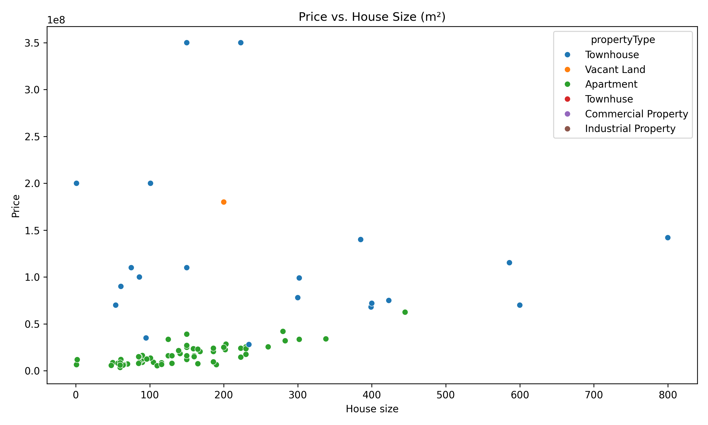
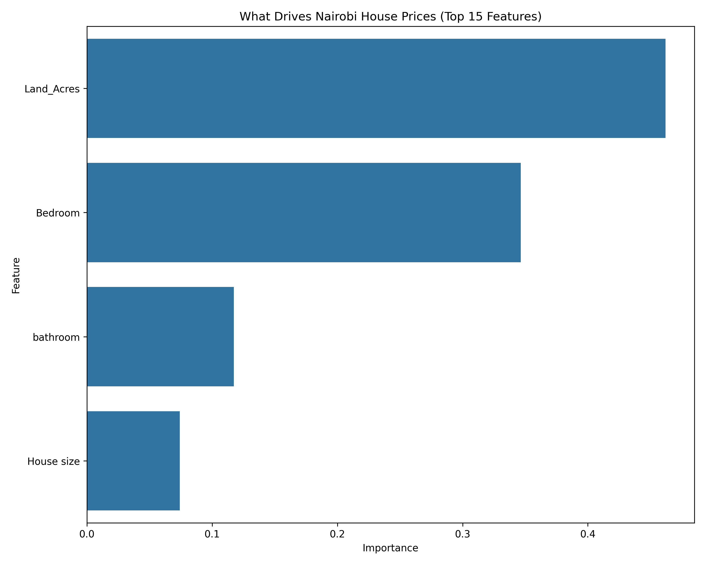
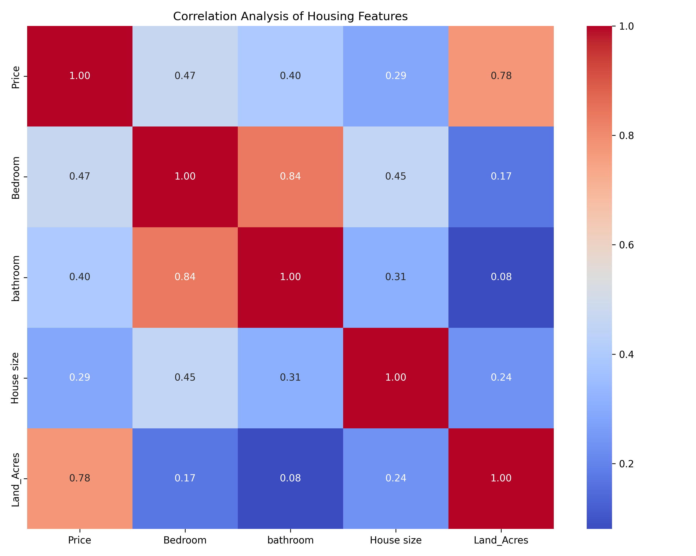

Nairobi Housing Price Analysis & Prediction

A complete data science project analyzing and predicting housing prices in Nairobi using machine learning.

This project covers:
- Data Cleaning
- Feature Engineering
- Exploratory Data Analysis (EDA)
- Visualization
- Machine Learning Modeling
- Feature Importance Analysis

---

Dataset

Dataset: `nairobi_housing.csv`

The dataset includes:
- Price
- Location
- Property Type
- Bedrooms
- Bathrooms
- House Size
- Land Size

---

Data Cleaning

- Removed "KSh", commas and special characters from `Price`
- Extracted numeric values from `House size`
- Standardized land size to Acres
- Filled missing bedroom & bathroom values using median

Exploratory Data Analysis

1️⃣ Top 10 Most Expensive Neighborhoods

2️⃣ Price vs House Size

3️⃣ Feature Importance (Random Forest)

4️⃣ Correlation Heatmap

Machine Learning Model

Model Used:
- Random Forest Regressor

Model Performance:

- R² Score
- Mean Absolute Error (MAE)

Tech Stack

- Python
- Pandas
- NumPy
- Matplotlib
- Seaborn
- Plotly
- Scikit-learn
- Folium

Future Improvements

-Deploy model using Streamlit

-Add geospatial mapping

-Hyperparameter tuning

-Feature scaling optimization

Author

Antony Ngugi Nyambura
Data Analyst | Data science Enthusiast